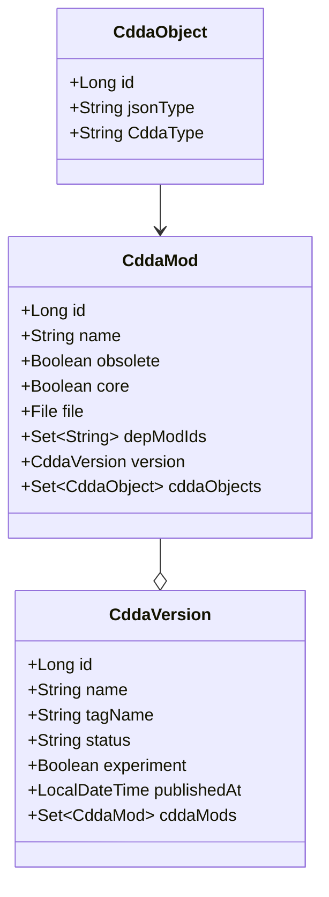

# Cdda Browser

## Entity Relationship

```mermaid
classDiagram
  class CddaVersion {
    +Long id
    +String name
    +String tagName
    +String status
    +Boolean experiment
    +LocalDateTime publishedAt
    +Set~CddaMod~ cddaMods
  }

  class CddaMod {
    +Long id
    +String name
    +Boolean obsolete
    +Boolean core
    +File file
    +Set~String~ depModIds
    +CddaVersion version
    +Set~CddaObject~ cddaObjects
  }

  class CddaObject {
    +Long id
    +String jsonType
    +String CddaType
  }

  CddaObject --> CddaMod
  CddaMod --o CddaVersion
```
